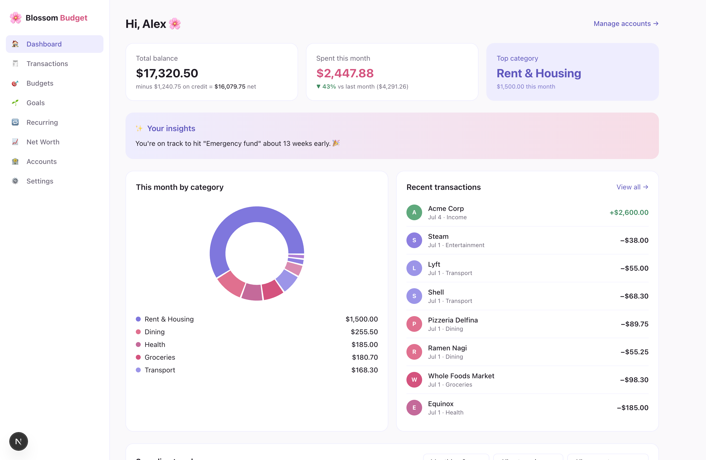
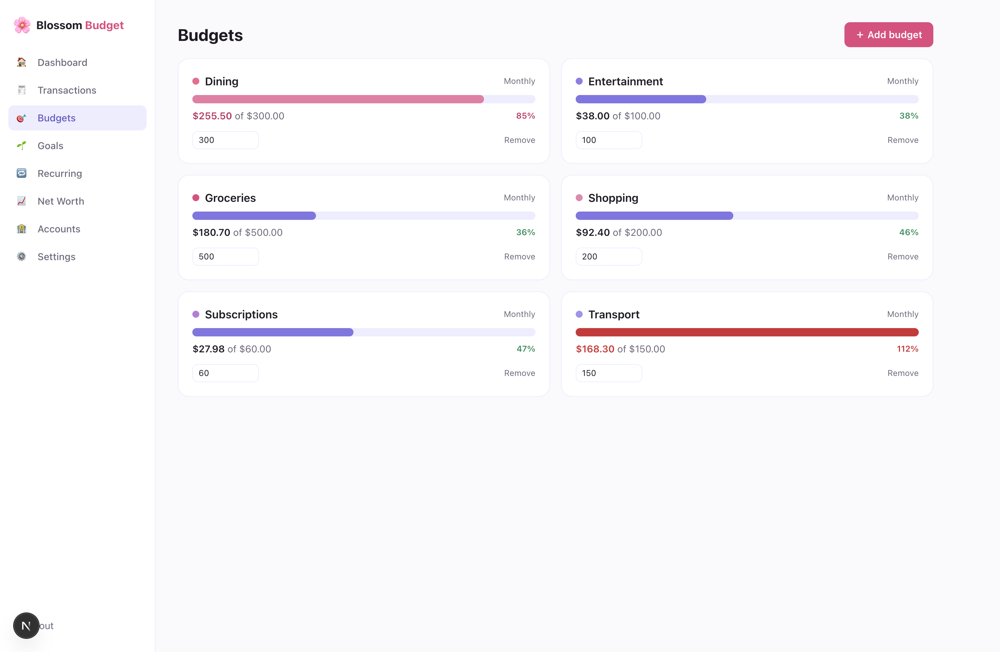
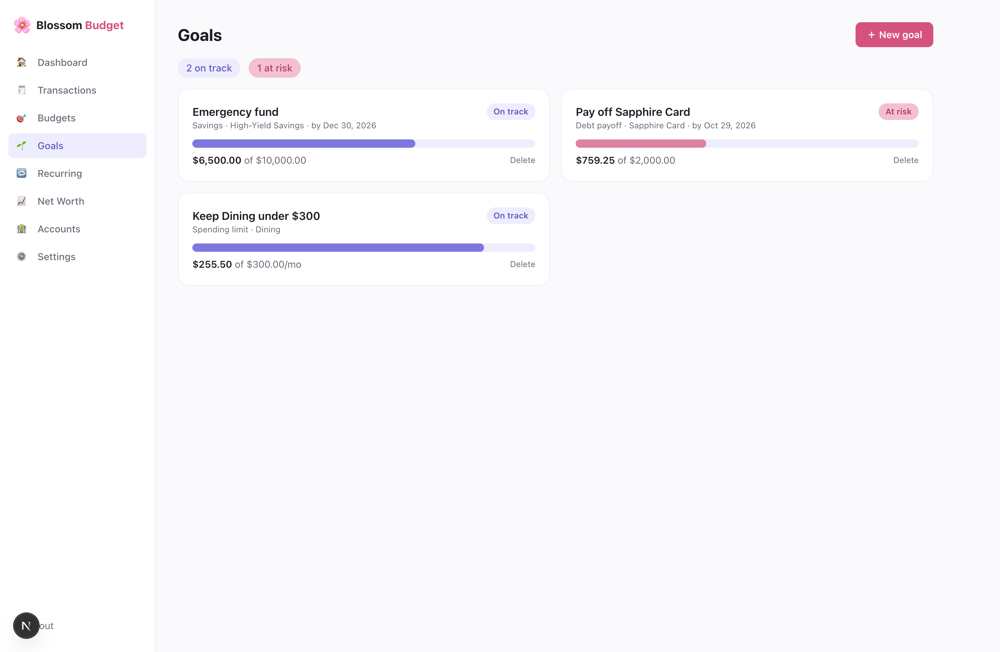
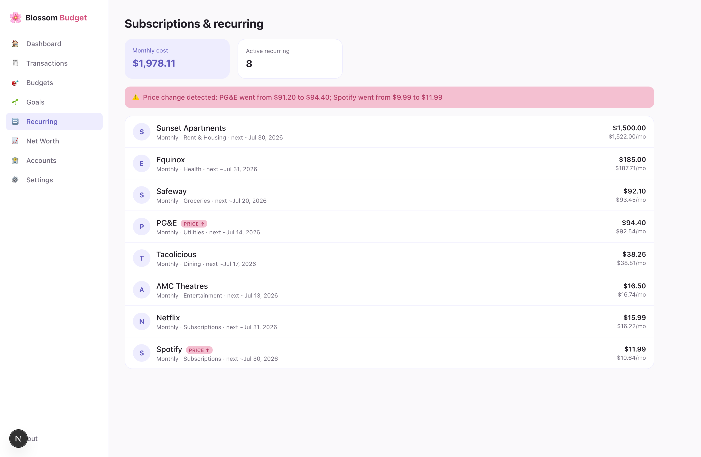
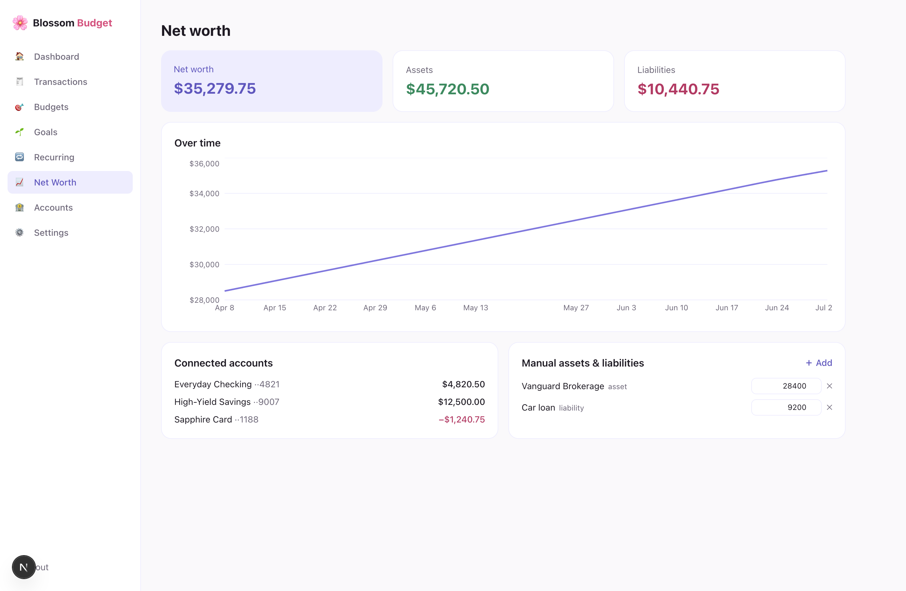
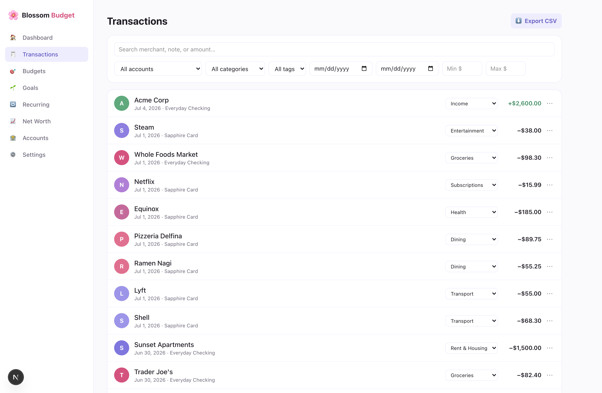

<div align="center">


# 🌸 Blossom Budget

**A personal budgeting web app with live bank sync, spending analytics, goals, and scheduled email reports.**

[](https://www.anthropic.com/claude)
[](https://nextjs.org)
[](https://www.typescriptlang.org)
[](https://www.prisma.io)
[](https://plaid.com)

</div>

---

> [!NOTE]
> **This is an experimental personal project**, designed and built end-to-end with **Claude Fable 5** — from the Prisma schema and Plaid integration to the UI, tests, and deployment. I use it to manage my own finances.
>
> **The live instance is currently restricted to me.** If you'd like access, shoot me an email at **nandini.t543@gmail.com** and I'm happy to add you. The full source is here if you'd rather deploy your own copy.

## Screenshots

<table>
  <tr>
    <td width="50%"><br/><sub><b>Dashboard</b> — balances, month-over-month spend, category donut, personalized insights</sub></td>
    <td width="50%"><br/><sub><b>Budgets</b> — per-category limits with 80% warning and over-budget states</sub></td>
  </tr>
  <tr>
    <td width="50%"><br/><sub><b>Goals</b> — savings, spending-limit, and debt-payoff goals with live progress</sub></td>
    <td width="50%"><br/><sub><b>Recurring</b> — auto-detected subscriptions with price-increase flags</sub></td>
  </tr>
  <tr>
    <td width="50%"><br/><sub><b>Net worth</b> — Plaid accounts + manual assets/liabilities, tracked over time</sub></td>
    <td width="50%"><br/><sub><b>Transactions</b> — search, combinable filters, inline recategorization, CSV export</sub></td>
  </tr>
</table>

<div align="center"><sub>Screenshots use seeded demo data, not real accounts.</sub></div>

## Features

- 🏦 **Bank sync** — connect accounts via Plaid Link; transactions and balances sync automatically, with re-auth prompts when a login expires
- 📊 **Spending dashboard** — balances, month-over-month spend, top categories, trend charts, and personalized insights from your own history
- 🎯 **Budgets & goals** — per-category budgets (weekly or monthly) and savings / spending-limit / debt-payoff goals, with progress bars and 80% / 100% alerts
- 🔁 **Recurring detection** — finds subscriptions & bills, flags price increases
- 📈 **Net worth** — aggregated across Plaid accounts plus manual assets/liabilities, with weekly snapshots and a trend chart
- 🔍 **Search, filters & tags** — full transaction search, combinable filters, custom tags like `tax-deductible`
- ✉️ **Email reports** — opt-in weekly/monthly summaries via Resend + cron
- ⬇️ **Data export** — CSV export with filters, plus a monthly PDF summary
- 📱 **Installable PWA** — mobile-first, responsive, add-to-home-screen

## Tech stack

**Next.js (App Router) · TypeScript · Tailwind CSS · PostgreSQL · Prisma · NextAuth · Plaid · Resend · Recharts · Vitest**

The palette throughout is pink `#D4537E` and lavender `#7F77DD` on a soft neutral base.

## Local setup

Prereqs: Node 20+, Docker (or any Postgres 15+), a free [Plaid sandbox account](https://dashboard.plaid.com/signup).

```bash
git clone https://github.com/nandinitiw/blossom-budget.git
cd blossom-budget
npm install

# Start a local Postgres (or point DATABASE_URL at your own)
docker run -d --name blossom-postgres \
  -e POSTGRES_PASSWORD=blossom_dev -e POSTGRES_USER=blossom \
  -e POSTGRES_DB=blossom_budget -p 5433:5432 postgres:16

# Configure environment
cp .env.example .env
# then fill in: NEXTAUTH_SECRET (openssl rand -base64 32),
# ENCRYPTION_KEY (openssl rand -hex 32), CRON_SECRET (openssl rand -hex 24),
# PLAID_CLIENT_ID / PLAID_SECRET (sandbox keys), RESEND_API_KEY (optional locally)

npm run db:migrate   # apply Prisma migrations
npm run dev          # http://localhost:3000
```

In Plaid **sandbox**, connect any bank in Plaid Link with credentials `user_good` / `pass_good` (OTP `1234` if prompted).

### Scripts

| Command | Description |
| --- | --- |
| `npm run dev` | Dev server |
| `npm run build` | Production build (runs migrations, then `next build`) |
| `npm run test` | Vitest unit + integration tests |
| `npm run lint` | ESLint |
| `npm run db:migrate` | Prisma migrate dev |
| `npm run db:studio` | Prisma Studio (DB browser) |

## Architecture

```
src/
  app/                # Next.js App Router
    (auth)/           # login, signup, forgot/reset password
    (app)/            # dashboard, transactions, budgets, goals,
                      # recurring, net worth, settings, onboarding
    api/              # route handlers (auth, plaid, crud, cron, export)
  lib/                # domain logic: plaid sync, categorization, budgets,
                      # recurring detection, net worth, insights, email
  components/         # shared UI
prisma/               # schema + migrations
docs/screenshots/     # images used in this README
.github/workflows/    # CI: lint, typecheck, tests
```

Key design points:

- **Plaid access tokens are AES-256-GCM encrypted at rest** (`src/lib/crypto.ts`); all Plaid calls happen server-side only.
- **Transaction sync** uses Plaid's `/transactions/sync` cursor API, triggered by Vercel Cron, the Plaid webhook, and on-demand after connecting.
- **Categorization** maps Plaid categories to app categories, overridden by per-merchant rules learned from the user's manual recategorizations.
- **Email reports** are idempotent via the `EmailLog` unique constraint on `(user, type, periodKey)`.
- Auth uses **JWT sessions** (HttpOnly, `__Secure-` cookies) with bcrypt password hashes, rate-limited endpoints, and single-use expiring password-reset tokens.
- Sign-ups can be restricted to an allowlist via `ALLOWED_SIGNUP_EMAILS` (how this instance stays single-user).

## Deployment (Vercel)

1. Create a managed Postgres database (Neon, Supabase, or Vercel Postgres).
2. Import this repo in Vercel; set all env vars from `.env.example` (`APP_URL` and `NEXTAUTH_URL` must be your exact `https://` production URL).
3. The build command runs `prisma migrate deploy`, so deploys auto-migrate.
4. Vercel Cron is configured in `vercel.json` (daily transaction sync, net-worth snapshots, and email reports). Set `CRON_SECRET` so only Vercel can call those endpoints.

### Moving Plaid from sandbox to production

Request Production access in the Plaid Dashboard (a short use-case questionnaire, ~1–2 days), pick the **Pay As You Go** plan (no commitment, usage-based billing — only select the **Transactions** product; the app doesn't need Balance, Auth, etc.), then switch `PLAID_ENV=production` and use your production secret.

To support OAuth banks (Chase, Bank of America, Wells Fargo, and most other major US institutions), add your production URL under **Team Settings → API → Allowed redirect URIs** in the Plaid Dashboard (e.g. `https://your-app.vercel.app/accounts`), then set `PLAID_REDIRECT_URI` to that exact value. Until then, only non-OAuth institutions will connect.

The app also has a soft 10-Item warning/cap (Settings and logs) as a sanity check against runaway connections — Plaid's own limits depend on your plan, so double-check the actual cap in your dashboard.

---

<div align="center"><sub>Built with 🌸 and Claude Fable 5.</sub></div>
